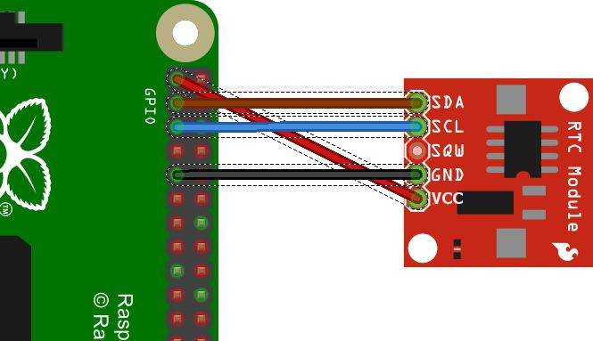

# GPS-ntp
Example config files for GPS NTP server

Here's how I created a nanosecond-accurate gps master ntp clock using chronyd, a raspberry pi, and a NEO-6M ublox clone.

You can create a GPS master that's "good enough" with millisecond accuracy with just the NEO-6M and a USB cable.
These instructions will tell you how to do either.

FIRST: get a GPS supported by GPSD chip.  Any GPS that is supported by gpsd, or speaks NMEA sentences will work.
NMEA sentences take more latency, so using one whose binary format is compatible helps if you aren't doing the high-power
setup.

I bought this counterfeit [NEO-6M GPS](https://www.amazon.com/dp/B07P8YMVNT?th=1)
but any chip with a USB out or a tty out, plus a PPS out will work.  See: [SUPORTED.md](SUPPORTED.md) for some notes on this.

IF you're going for the nanoscale one, I'm going to assume you're using a raspberry Pi model B, but will show you which pins matter if you're using something else.

If you're using a RPI, and want to use the pps nanoscale option:

Get [Raspibian](https://www.raspbian.org/) set up.  Basic raspibian setup is beyond the scope of this document, and you can find information on the website on how to do it.

After you get Raspibian set up, you'll want to do the following:

* Add this line to your /boot.txt:<br>
`dtoverlay=pps-gpio,gpiopin=18`

* If you want to use the tty output (which I didn't, for ease of use) add these lines to /boot.txt<br>
`enable_uart=1`<br>
`init_uart_baud=9600`<br>

I just use the USB connection, it's better quality.

Now, you'll have to do some soldering.  Solder the header onto the GPS chip.  You really only need two pinouts, GND and PPS.<br>
GND goes to pin 3 on the rpi pinout<br>
PPI goes to GPIO 18 (which is pin 6, i know, its weird)<br>
Refer to the rpi B pinout here, or whatever you're using.<br>


Boot up your rpi, and now let's set up gpsd.
I have a sample config file in in this project above that goes in /etc/default/gpsd

Now, set up chronyd.  I have a sample config file for that in this project above.

You know it works if you see the following output for "chronyc sources"
<pre>
`MS Name/IP address         Stratum Poll Reach LastRx Last sample
===============================================================================
#- GPS                           0   4   377    12    +51ms[  +51ms] +/-  163ms
#* PPS                           0   4   377    12   +558ns[ +739ns] +/-  312ns
^- lofn.fancube.com              2  10   377   146  -1415us[-1415us] +/-   42ms
^- sg.ntp.tlercher.de            2  10   377    92    +12ms[  +12ms] +/-  116ms
^- ntp18.doctor.com              2   9   377   220   +369us[ +370us] +/-   46ms
^- 205.159.239.5                 2  10   377   841   -346us[ -377us] +/-   70ms`
</pre>

MORE FOR SETTING UP AN [RTC](https://pimylifeup.com/raspberry-pi-rtc/)

WHY would you want to do this?

* You're a huge nerd and like playing with stuff
* You're a HAM in a remote area and need good timing for protocols like FT8
* You don't trust services like pool.ntp.org


---

# GPSD and pops checking

Verify status:

```bash
systemctl status gpsd
```

---

# Verifying GPS Connectivity

## Using `cgps`

Run:

```bash
cgps
```

Expected:
- GPS fix
- satellite data
- UTC time
- coordinates

---

## Using `gpspipe`

Raw GPS data:

```bash
gpspipe -r
```

Expected NMEA output:

```text
$GPRMC,...
$GPGGA,...
```

---

# Verifying PPS

Ensure PPS device exists:

```bash
ls -l /dev/pps*
```

Expected:

```text
/dev/pps0
```

Verify PPS kernel modules:

```bash
lsmod | grep pps
```

Typical modules:

```text
pps_core
pps_gpio
```

---

## PPS Pulse Test

Run:

```bash
sudo ppstest /dev/pps0
```

Healthy output:

```text
source 0 - assert 1778375890.999996411, sequence: 815
source 0 - assert 1778375891.999995981, sequence: 816
```

This confirms:
- PPS GPIO overlay is working
- kernel PPS support is functioning
- PPS pulses are arriving correctly

---

# Chrony Configuration

Example Chrony refclock configuration:

```text
refclock SHM 0 offset 0.5 delay 0.2 refid GPS noselect
refclock PPS /dev/pps0 lock GPS refid PPS
```

Notes:

- GPS serial time is used for coarse UTC time
- PPS provides precise second-edge timing
- `lock GPS` associates PPS pulses with GPS time

Restart Chrony:

```bash
sudo systemctl restart chrony
```

---

# Verifying Chrony

Check synchronization sources:

```bash
chronyc sources -v
```

Healthy output example:

```text
MS Name/IP address         Stratum Poll Reach LastRx Last sample
===============================================================================
#- GPS                           0   4     7    13    +31ms[  +32ms] +/-  163ms
#* PPS                           0   4     7    12   -613ns[ +404us] +/-  207ns
```

Meaning:

- `#* PPS`
  - PPS is the selected synchronization source
- `#- GPS`
  - GPS serial source is present but not selected
- `Reach`
  - NTP reachability register (displayed in octal)
- `377`
  - healthy recent polling history

---

# DHCP NTP Sources

Chrony may automatically import DHCP-provided NTP servers through:

```text
sourcedir /run/chrony-dhcp
```

These may appear unexpectedly in:

```bash
chronyc sources -v
```

For a dedicated GPS/PPS appliance, DHCP NTP sources are usually unnecessary and may be disabled.

---

# Common Troubleshooting

## No `/dev/pps0`

Check:
- dtoverlay line
- PPS wiring
- reboot completed
- kernel modules loaded

---

## GPS Works But PPS Does Not

Check:
- PPS GPIO wiring
- correct GPIO pin number
- `ppstest /dev/pps0`

---

## PPS Works But Chrony Shows `#?`

Usually means:
- GPS serial source not working
- PPS not locked to GPS
- Chrony has not received enough valid samples yet

Wait a few polling intervals and verify GPS connectivity.

---

# Useful Commands

```bash
chronyc tracking
chronyc sources -v
gpspipe -r
cgps
ppstest /dev/pps0
```


